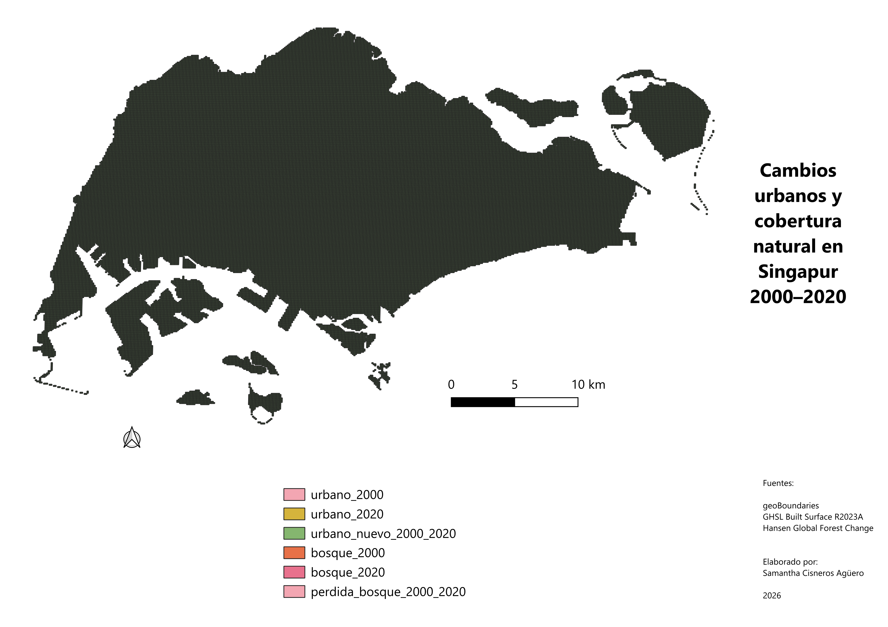

Proyecto Final QGIS 2026

Área de analisis

Singapur

Objetivo

Analizar los cambios urbanos y de cobertura natural en Singapur entre los años 2000 y 2020.

Definiciones utilizadas

- Urbano: áreas clasificadas a partir de datos GHSL.
- Bosque: áreas identificadas mediante Hansen Global Forest Change.

Capas generadas

- singapore_area
- urbano_2000
- urbano_2020
- urbano_nuevo_2000_2020
- bosque_2000
- bosque_2020
- perdida_bosque_2000_2020

Fuentes

- geoBoundaries
- GHSL Built Surface R2023A
- Hansen Global Forest Change

Resultados

Se identificaron cambios en la cobertura urbana y natural de Singapur entre 2000 y 2020.

Limitaciones

- Los resultados no tienen mucha diferencia debido a la densidad poblacional. 

- La pérdida forestal representa pérdida de cobertura arbórea y no necesariamente deforestación neta causada por el urbanismo indiscriminado.

Mapa final

El mapa final del proyecto fue exportado en formato PDF y PNG.

